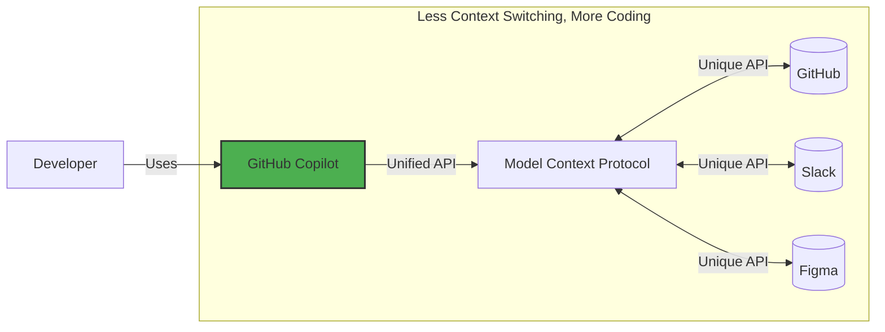

## Step 1: Introduction to MCP and environment setup


In the [Getting Started with GitHub Copilot](https://github.com/skills/getting-started-with-github-copilot) exercise, we were introduced to the Mergington High School's extracurricular activities website, which allowed students to sign up for events.

And now we have a problem... but.. it's a good one! More teachers are asking to use it! 🎉

Our fellow teachers have lots of ideas but we can't seem to keep up with all the requests! 😮 To fix this issue, lets give GitHub Copilot an upgrade by enabling Model Context Protocol (MCP). To be more specific, we will add the GitHub MCP server, which will enable a combined workflow of issue management and website upgrades. 🧑‍🚀

Let's get started!

### What is Model Context Protocol (MCP)?

[Model Context Protocol (MCP)](https://modelcontextprotocol.io/introduction) is often referred to as "USB-C for AI" - a universal connector that allows GitHub Copilot (and other AI tools) to seamlessly interact with other services.

Essentially, it is a way to describe the capabilities and requirements of a service, so AI tools can easily determine what methods to use and to accurately provide the parameters. An MCP server is providing that interface.



### :keyboard: Activity: Get to know your environment

Before we dive into MCP, let's start up our development environment and refamiliarize ourself with the extracurricular activity application.

1. Right-click the below button to open the **Create Codespace** page in a new tab. Use the default configuration.

   [](https://codespaces.new/{{full_repo_name}}?quickstart=1)

1. Validate the **Copilot Chat** and **Python** extensions are installed and enabled.

   <br/>
   

1. Verify our application runs before modification. In the left sidebar, select the **Run and Debug** tab and then press the **Start Debugging** icon.

   <details>
   <summary>📸 Show screenshot</summary><br/>

   

   </details>

   <details>
   <summary>🤷 Having trouble?</summary><br/>

   If the **Run and Debug** area is empty, try reloading VS Code: Open the command palette (`Ctrl`+`Shift`+`P`) and search for `Developer: Reload Window`.

   

   </details>

1. Use the **Ports** tab to find the webpage address, open it, and verify it is running.

   <details>
   <summary>📸 Show screenshot</summary><br/>

   

   

   </details>

### :keyboard: Activity: Add the GitHub MCP server

1. Inside your codespace, open the **Copilot Chat** panel and verify **Agent** mode is selected.

   

   <details>
   <summary>Agent mode missing?</summary><br/>

   - Verify VS Code is at least `v1.99.0`.
   - Verify the Copilot extension is at least `v1.296.0`.
   - Check if Agent mode is enabled in your [user or workspace settings](https://code.visualstudio.com/docs/configure/settings#_workspace-settings).

      

   </details>

1. Inside your codespace, navigate to the `.vscode` folder, and create a new file named `mcp.json`. Paste the following contents:

   📄 **.vscode/mcp.json**

   ```json
   {
     "servers": {
       "github": {
         "type": "http",
         "url": "https://api.githubcopilot.com/mcp/"
       }
     }
   }
   ```

1. In the `.vscode/mcp.json` file, click the **Start** button and accept the prompt to authenticate with GitHub. This has just informed GitHub Copilot of the MCP server's capabilities.

   

   <br/>

   

1. In the Copilot side panel, click the **🛠️ icon** to show the additional capabilities.

   

   

1. **Commit** and **push** the `.vscode/mcp.json` file to the `main` branch.

   > 🪧 **Note:** Pushing directly to `main` is not a recommended practice. It is only to simplify this exercise.

1. Now that your MCP server configuration is pushed to GitHub, Mona should already be busy checking your work. Give her a moment and keep watch in the comments. You will see her respond with progress info and the next lesson.

> [!NOTE]
> The next steps will involve creating GitHub issues. If you would like to avoid notification emails, you can unwatch the repository.

<details>
<summary>Having trouble?</summary><br/>

Make sure:

- Your `.vscode/mcp.json` file is similar to the example provided.
- You pushed the changes to the `main` branch.

</details>
